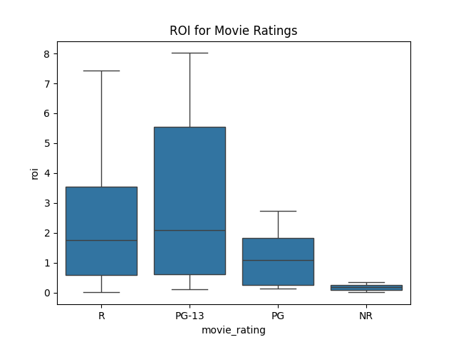

# Movie Studio Analysis

# Overview
This project analyzes databases of movies to recommend the best movie studio to invest in.

# Business Problem
We are venturing into the movie industry and have developed a short-term and a long-term plan. In the short term, we want to maximize return of investment and minimize the budget. We need to do this in order to create a strong financial foundation and ensure future success. In the long-term, we would like to develop films that give writers and directors more artistic freedom and therefore, garner higher critical acclaim.

# Data Sources
This data includes information from Rotten Tomatoes, Box Office Mojo, The Movie Database, The Numbers, and Internet Movie Database.

# Methods
This project uses descriptive analysis, comparative analysis, and visualizations to conclude the various datasets.

# Results
## Who is our Audience

With a sample size of 40, PG-13 has the highest median value 

## Current Trending Directors

## Current Trending Writers

## Freshness to Rotten Ratio

Highest-rated genres by top critics

# Conclusions
This analysis yields three actionable recommendations for your business to review:

- Using the Film Rating System, our target audience is 13 years old and up
- Genres
    - Horror
    - Mystery 
    - Thriller
- Directors/Writers
    - Directors: Chad Stahelski, Denis Villeneuve
    - Writers: Derek Kolstad, Luc Besson

# For More Information
See the full analysis in the Jupyter Notebook or review this presentation. For additional info, contact Juan Acosta, Julie Leung, or Jason Mix.

